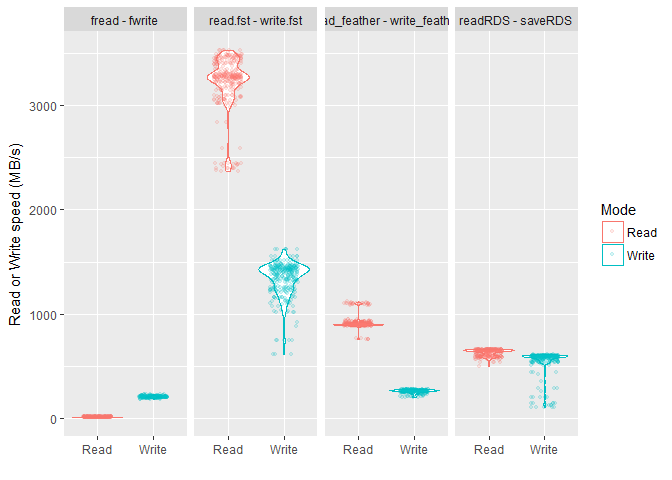
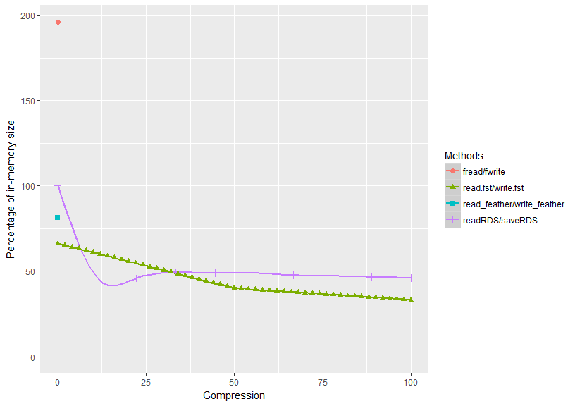
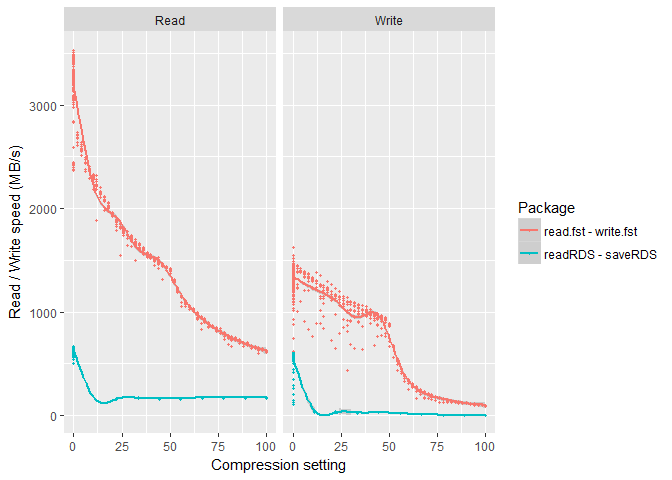

<!-- README.md is generated from README.Rmd. Please edit that file -->


[](https://travis-ci.org/fstpackage/fst) [](https://cran.r-project.org/package=fst)
[](https://codecov.io/gh/fstpackage/fst)
[](https://www.rdocumentation.org/packages/fst)

Overview
--------

Package `fst` [(code here)](https://github.com/fstpackage/fst) provides a fast, easy and flexible way to serialize data frames. It allows for fast compression and decompression and has the ability to access stored frames randomly. With access speeds of above 1 GB/s, `fst` is specifically designed to unlock the potential of high speed solid state disks that can be found in most modern computers. The figure below compares the read and write performance of the `fst` package to various alternatives.

| Method         | Format |    Time (s)| Size (MB) | Speed (MB/s)|    N|
|:---------------|:-------|-----------:|:----------|------------:|-----:|
| **read.fst**   | bin    |   0.0611263| 133       |       3271.9|  1397|
| **write.fst**  | bin    |   0.1427031| 133       |       1401.5|  1397|
| read\_feather  | bin    |   0.2228486| 163       |        897.5|  1270|
| readRDS        | bin    |   0.3089175| 200       |        647.4|  1397|
| saveRDS        | bin    |   0.3406979| 200       |        587.0|  1270|
| write\_feather | bin    |   0.7631548| 163       |        262.1|  1270|
| fwrite         | *csv*  |   0.9813563| 392       |        203.8|  1270|
| fread          | *csv*  |  17.1259319| 392       |         11.7|  1270|

These benchmarks were performed on a Xeon E5 CPU @2.5GHz (more systems will follow). Parameter *speed* was calculated by dividing the in-memory size of the data frame by the measured time. The results are also visualized in the figure below.



Package `fst` outperforms the `feather` and `data.table` packages as well as the base `readRDS` / `writeRDS` functions for uncompressed reads and writes. But it also offers additional features such as very fast compression and random access (columns and rows) to the stored data.

Installation
------------

The easiest way to install the package is from CRAN:

``` r
install.packages("fst")
```

You can also use the development version from GitHub:

``` r
# install.packages("devtools")
devtools::install_github("fstPackage/fst", ref = "develop")
```

Basic usage
-----------

Using `fst` is extremely simple. Data can be stored and retrieved using methods `fst.write` and `fst.read`:

``` r
# Generate a random data frame with 10 million rows and various column types
nrOfRows <- 1e7

x <- data.frame(
  Integers = 1:nrOfRows,  # integer
  Logicals = sample(c(TRUE, FALSE, NA), nrOfRows, replace = TRUE),  # logical
  Text = factor(sample(state.name, nrOfRows, replace = TRUE)),  # text
  Numericals = runif(nrOfRows, 0.0, 100),  # numericals
  stringsAsFactors = FALSE)

# Store it
  write.fst(x, "dataset.fst")
  
# Retrieve it
  y <- read.fst("dataset.fst")
```

Random access
-------------

With `read.fst` you can access a selection of rows from the stored data frame by specifying a range:

``` r
  read.fst("dataset.fst", from = 2000, to = 4990)  # subset rows
```

You will notice that the read times for this small subset are very short because `read.fst` (almost) only touches the on-disk data from within the selected range. Specific columns can be selected with:

``` r
  read.fst("dataset.fst", c("Logicals", "Text"), 2000, 4990) # subset rows and columns
```

Here, only data from the selected rows and columns are deserialized from file.

Compression
-----------

For compression the excellent and speedy [LZ4](https://github.com/lz4/lz4) and [ZSTD](https://github.com/facebook/zstd) compression algorithms are used. These compressors in combination with type-specific bit and byte filters, enable `fst` to achieve high compression speeds at reasonable compression factors. The compression factor can be tuned from 0 (minimum) to 100 (maximum):

``` r
  write.fst(x, "dataset.fst", 100)  # use maximum compression
```

For this particular data frame the on-disk size of `x` is less than 35 percent of the in-memory size (`object.size(x)`) when full compression is used. The figure below shows the compression ratio depending on the settings used and compares them to the ratio's achieved by the `feather` and `data.table` packages (that offer no additional compression) and method `saveRDS` (gzip mode) from base R:



Note that the on-disk size of a csv file is usually larger than the in-memory size (here with a factor of about 2). Obviously, csv files are text-based and it's no surprise that deserializing from text-based sources takes more time (due to neccessary text parsing). For a non-binary-file writer, method `fwrite` from the `data.table` package actually has a very impressive performance! There are only 10 settings for compression in `saveRDS` (gzip mode), which have been scaled up from 0 (uncompressed) to 100 (setting 9) for easier comparison.

The read and write speeds measured in the same benchmark:



The read and write speeds reported in the figure are calculated by dividing the in-memory size of the data frame by the measured elapsed time for a read or write operation (more details will follow). As you can see, `fst` achieves very high read and write speeds, even for compressed data. For this benchmark, a Intel Xeon E5 CPU was used, running at 2.5 GHz. To cope with the large IO speeds, a OCZ RevoDrive 350 was used with maximum read and write speeds of around 1750 MB/s.

As you can see from the figure, the benchmark measures higher speeds than the reported maximum SSD speed for low compression settings. This is due to the fact that the on-disk filesize of the data frame used is actually significantly smaller than the in-memory size, even at a compression setting of zero. Package `fst` employs several type-specific byte- and bit- shifters that are used even in uncompressed mode. For example, a single logical value in R takes up 32 bits in memory, and only 2 bits on-disk (there are 3 possible values: `TRUE`, `FALSE`, and `NA`).

> **Note to users**: The binary format used for data storage by the package (the 'fst file format') is expected to evolve in the coming months. Therefore, **`fst` should not be used for long-term data storage**.
