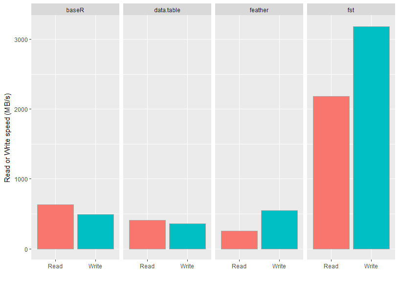
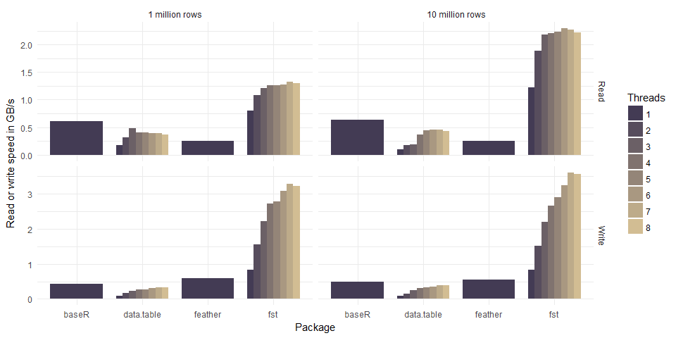

<!-- README.md is generated from README.Rmd. Please edit that file -->


[](https://travis-ci.org/fstpackage/fst) [](https://ci.appveyor.com/project/fstpackage/fst/branch/develop) [](https://www.gnu.org/licenses/agpl-3.0) [](https://cran.r-project.org/package=fst) [](https://codecov.io/gh/fstpackage/fst) [](http://cran.rstudio.com/web/packages/fst/index.html)

Overview
--------

The [*fst* package](https://github.com/fstpackage/fst) for R provides a fast, easy and flexible way to serialize data frames. With access speeds of multiple GB/s, *fst* is specifically designed to unlock the potential of high speed solid state disks that can be found in most modern computers. Data frames stored in the *fst* format have full random access, both in column and rows.

The figure below compares the read and write performance of the *fst* package to various alternatives.

| Method         | Format  | Time (ms) | Size (MB) | Speed (MB/s) | N       |
|:---------------|:--------|:----------|:----------|:-------------|:--------|
| readRDS        | bin     | 1577      | 1000      | 633          | 112     |
| saveRDS        | bin     | 2042      | 1000      | 489          | 112     |
| fread          | csv     | 2925      | 1038      | 410          | 232     |
| fwrite         | csv     | 2790      | 1038      | 358          | 241     |
| read\_feather  | bin     | 3950      | 813       | 253          | 112     |
| write\_feather | bin     | 1820      | 813       | 549          | 112     |
| **read\_fst**  | **bin** | **457**   | **303**   | **2184**     | **282** |
| **write\_fst** | **bin** | **314**   | **303**   | **3180**     | **291** |

These benchmarks were performed on a laptop (i7 4710HQ @2.5 GHz) with a reasonably fast SSD (M.2 Samsung SM951) using the dataset defined below. Parameter *Speed* was calculated by dividing the in-memory size of the data frame by the measured time. These results are also visualized in the following graph:



As can be seen from the figure, the measured speeds for the *fst* package are very high and even top the maximum drive speed of the SSD used. The package accomplishes this by an effective combination of multi-threading and compression. The on-disk file sizes of *fst* files are also much smaller than that of the other formats tested. This is an added benefit of *fst*'s use of type-specific compressors on each stored column.

In addition to methods for data frame serialization, *fst* also provides methods for multi-threaded in-memory compression with the popular LZ4 and ZSTD compressors and an extremely fast multi-threaded hasher.

Multi-threading
---------------

The *fst* package relies heavily on multi-threading to boost the read- and write speed of data frames. To maximize throughput, *fst* compresses and decompresses data *in the background* and tries to keep the disk busy writing and reading data at the same time.

Installation
------------

The easiest way to install the package is from CRAN:

``` r
install.packages("fst")
```

You can also use the development version from GitHub:

``` r
# install.packages("devtools")
devtools::install_github("fstPackage/fst", ref = "develop")
```

Basic usage
-----------

Using *fst* is simple. Data can be stored and retrieved using methods *write\_fst* and *read\_fst*:

``` r
# Generate some random data frame with 10 million rows and various column types
nr_of_rows <- 1e7

df <- data.frame(
    Logical = sample(c(TRUE, FALSE, NA), prob = c(0.85, 0.1, 0.05), nr_of_rows, replace = TRUE),
    Integer = sample(1L:100L, nr_of_rows, replace = TRUE),
    Real = sample(sample(1:10000, 20) / 100, nr_of_rows, replace = TRUE),
    Factor = as.factor(sample(labels(UScitiesD), nr_of_rows, replace = TRUE))
  )

# Store the data frame to disk
  write.fst(df, "dataset.fst")
  
# Retrieve the data frame again
  df <- read.fst("dataset.fst")
```

*Note: the dataset defined in this example code was also used to obtain the benchmark results shown in the introduction.*

Random access
-------------

The *fst* file format provides full random access to stored datasets. You can retrieve a selection of columns and rows with:

``` r
  df_subset <- read.fst("dataset.fst", c("Logical", "Factor"), from = 2000, to = 5000)
```

This reads rows 1000 to 5000 from columns *Logical* and *Factor* without actually touching any other data in the stored file. That means that a subset can be read from file **without reading the complete file first**. This is different from, say, *readRDS* or *read\_feather* where you have to read the complete file or column before you can make a subset.

Compression
-----------

For compression the excellent and speedy [LZ4](https://github.com/lz4/lz4) and [ZSTD](https://github.com/facebook/zstd) compression algorithms are used. These compressors (in combination with type-specific bit filters), enable *fst* to achieve high compression speeds at reasonable compression factors. The compression factor can be tuned from 0 (minimum) to 100 (maximum):

``` r
write.fst(df, "dataset.fst", 100)  # use maximum compression
```

Compression reduces the size of the *fst* file that holds your data. But because the (de-)compression is done *on background threads*, it can increase the total read- and write speed as well. The graph below shows how the use of multiple threads enhances the read and write speed of our sample dataset.



The *csv* format used by the *fread* and *fwrite* methods of package *data.table* is actually a human-readable text format and not a binary format. Normally, binary formats would be much faster than the *csv* format, because *csv* takes more space on disk, is row based, uncompressed and needs to be parsed into a computer-native format to have any meaning. So any serializer that's working on *csv* has an enormous disadvantage as compared to binary formats. Yet, the results show that *data.table* is on par with binary formats and when more threads are used, it can even be faster. Because of this impressive performance, it was included in the graph for comparison.

Bindings in other languages
---------------------------

**Julia**: [**`fstformat.jl`**](https://github.com/xiaodaigh/fstformat.jl) A naive Julia binding using RCall.jl

> **Note to users**: From CRAN release v0.8.0, the *fst* format is stable and backwards compatible. That means that all *fst* files generated with package v0.8.0 or later can be read by future versions of the package.
